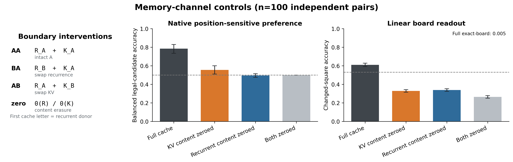
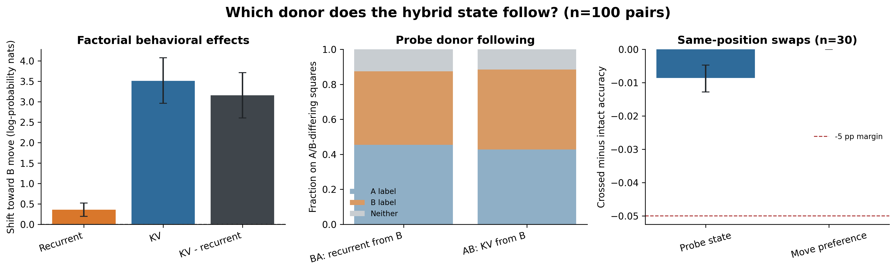
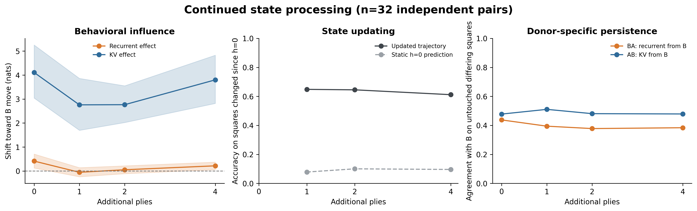

# Tracing Chess Position Information in Qwen3.5

A causal study of recurrent and attention memory in a frozen hybrid language model.

## Research question

Qwen3.5 combines recurrent Gated DeltaNet layers with full-attention layers. When the model infers a chess position from a sequence of moves, which memory channel carries information that influences its next-move predictions?

I tested this by transplanting recurrent states and attention KV caches between matched chess-game histories. Chess makes the experiment externally verifiable: the current board and legal moves are exactly determined by the history, but the board itself is never provided to the model.

The study separates three questions that can easily be conflated:

1. Can board information be decoded from the model?
2. Which stored information causally changes the model's predictions?
3. Does that influence persist as additional moves arrive?

## Main result

Attention KV content had a substantially larger donor-specific effect on the model's legal-move preference than recurrent content.

| Effect | Estimate | 95% bootstrap interval |
| --- | ---: | ---: |
| Recurrent donor effect | 0.35 nats | [0.19, 0.52] |
| KV donor effect | 3.51 nats | [2.96, 4.08] |
| KV minus recurrent | 3.16 nats | [2.60, 3.71] |
| Interaction | 0.01 nats | [-0.18, 0.20] |

However, this does **not** mean recurrent memory was irrelevant. Zeroing recurrent content reduced balanced legal-candidate accuracy from 78.5% to 49.5%. Donor-specific influence and sensitivity to memory disruption appear to measure different properties.



## Experimental design

The experiment used frozen [`Qwen/Qwen3.5-4B-Base`](https://huggingface.co/Qwen/Qwen3.5-4B-Base), containing 24 Gated DeltaNet layers and eight full-attention layers.

Inputs were real Lichess game histories written in UCI notation:

```text
Chess game from the standard starting position. Moves are in UCI notation.
Moves: e2e4 e7e5 g1f3
Next move:
```

The model was never shown a board representation or FEN string. `python-chess` reconstructed the reference board and supplied legal-move labels.

For every matched pair of positions A and B:

- Both histories had the same ply count, tokenized length, side to move, piece count, and check status.
- Move `a` was legal only in A, while move `b` was legal only in B.
- Candidate moves had equal token counts and were selected without inspecting model scores.

The four factorial cache conditions were:

| Condition | Recurrent content | Attention KV content |
| --- | --- | --- |
| `AA` | Position A | Position A |
| `BB` | Position B | Position B |
| `BA` | Position B | Position A |
| `AB` | Position A | Position B |

For each condition `C`, behavior was measured as:

```text
d(C) = log P(move b | C) - log P(move a | C)
```

Positive values indicate greater preference for the move legal in position B.

## Evaluation

The completed evaluation contained:

- 500 positions for fitting linear readouts
- 100 development positions
- 100 held-out primary position pairs
- 32 continuation pairs evaluated after 0, 1, 2, and 4 additional plies
- 30 transposition triplets containing different histories that reached the same board

Only linear ridge readouts were trained. Qwen's parameters remained frozen. Uncertainty intervals used 10,000 paired cluster-bootstrap samples.

## Findings

### KV content had greater donor-specific behavioral influence

Swapping KV content shifted the model's relative probability toward the KV donor's legal move much more strongly than swapping recurrent content.



### Recurrent content was still important

| Condition | Balanced legal-candidate accuracy |
| --- | ---: |
| Full cache | 78.5% |
| KV content zeroed | 55.5% |
| Recurrent content zeroed | 49.5% |
| Both contents zeroed | 50.0% |

Zeroing creates an abnormal internal state, so some of this loss may reflect general disruption rather than removal of a specific chess representation.

### Board information was partially linearly readable

The final-query linear readout recovered:

- 78.7% of all board squares
- 61.0% of squares changed from the initial board
- 53.0% changed-square accuracy for the strongest cheap baseline
- 0.5% exact 64-square board recovery

The readout detected board-related information but was not a reliable complete-board decoder.

### Crossed caches did not produce a clean donor board

On squares where positions A and B differed, crossed-cache predictions contained a mixture of labels from both donors. Strong behavioral influence from one channel did not correspond to transplanting a complete, linearly readable donor board.

### KV donor influence persisted after further moves

The KV effect remained positive after one, two, and four additional legal plies.



Both recurrent and attention layers processed the new moves. This identifies persistent influence from boundary-carried KV content, not the mechanism or layers responsible for updating the position.

## Interpretation

The supported conclusion is deliberately narrow:

> In this frozen Qwen3.5 chess assay, attention KV donor content had a larger causal effect on position-sensitive move preference than recurrent donor content.

The results do not establish that:

- KV exclusively stores the model's chess state
- the model maintains a complete symbolic board
- recurrent layers are unimportant
- the linear readout identifies the representation used by the model
- either channel alone performs state updating

The mismatch between transplantation and erasure is itself informative: a memory channel can have weak donor-specific control while remaining important for competent computation.

## Connection to previous work

This project was motivated by earlier Atlas composition experiments investigating whether independently learned operators could communicate through a shared internal coordinate system.

Those experiments trained interfaces over controlled state spaces. This study instead asks whether transferable state can already be found inside a pretrained model without training an Atlas interface. No Atlas operators or continual-learning mechanisms were trained here.

## Limitations

- This study evaluates one frozen model checkpoint.
- Whole-channel transplantation can create out-of-distribution internal states.
- Recurrent and attention layers exchange information during normal processing.
- The readout uses the final query activation, not individual cache tensors.
- Probe success does not establish causal use, and probe failure does not establish absence.
- The same-position behavioral control began at chance-level accuracy.
- The continuation assay does not exclude every local move-parsing strategy.
- The results concern a matched chess diagnostic, not general language-model memory.

## Repository structure

```text
qwen35_chess_memory.py
requirements_qwen35_chess_memory.txt
data/qwen35_chess_memory/
    config.json
    manifest.json
docs/
    qwen35_chess_memory_plan.md
    qwen35_chess_memory_runbook.md
tests/
    test_qwen35_chess_memory.py
notebooks/
    qwen35_chess_memory_results_colab.ipynb
results/
    summary.json
    metrics.csv
    verification.json
    decisions.md
    primary.jsonl
    continuations.jsonl
    transpositions.jsonl
figures/
    01_memory_conditions.png
    02_donor_following.png
    03_continuation.png
    04_board_examples.png
    04b_failure_example.png
```

## Running the tests

```bash
python -m pip install -r requirements_qwen35_chess_memory.txt
python -m pytest tests/test_qwen35_chess_memory.py -q
```

The complete ordered experiment commands are in [`docs/qwen35_chess_memory_runbook.md`](docs/qwen35_chess_memory_runbook.md).

Running the full experiment requires downloading Qwen3.5-4B-Base. Inspecting the saved results and recomputing the primary effects does not require the model checkpoint.

## Artifact integrity

The repository includes raw held-out result journals and `verification.json`. The verification stage checked completion markers, frozen model parameters, candidate-score arithmetic, factorial-effect arithmetic, and artifact hashes.

The repository contains no Qwen model weights, Hugging Face caches, or intermediate model caches.

## Methodological credit

Crossing recurrent and attention caches follows:

- Afendulev et al., [*What Attention Recalls and Recurrence Controls in Hybrid Language Models*](https://arxiv.org/abs/2609.04434)

Related board-state interpretability work:

- Neel Nanda, [*Actually, Othello-GPT Has A Linear Emergent World Representation*](https://www.neelnanda.io/mechanistic-interpretability/othello)

Data and tooling:

- [Lichess Open Database](https://database.lichess.org/)
- [`python-chess`](https://python-chess.readthedocs.io/)
